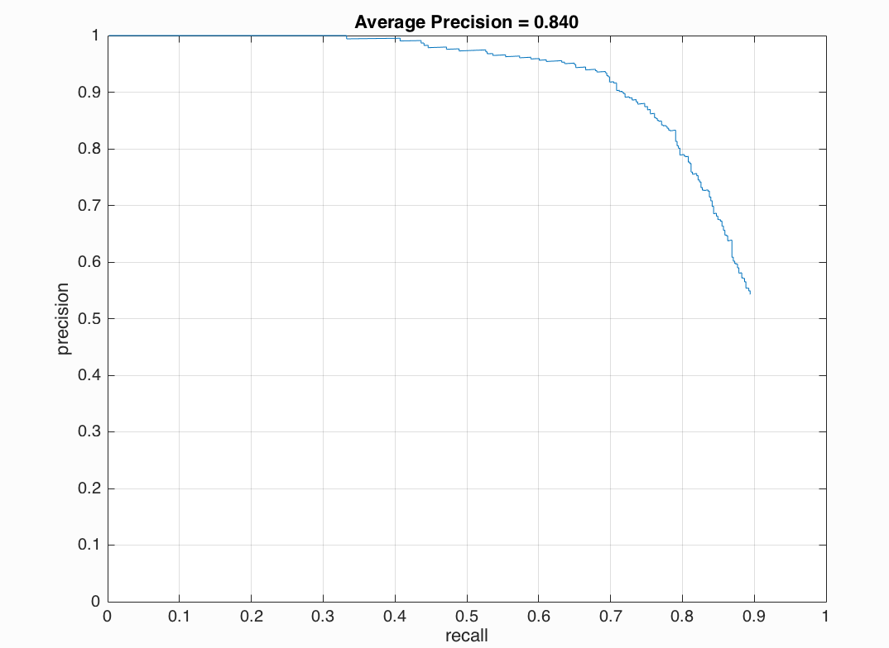
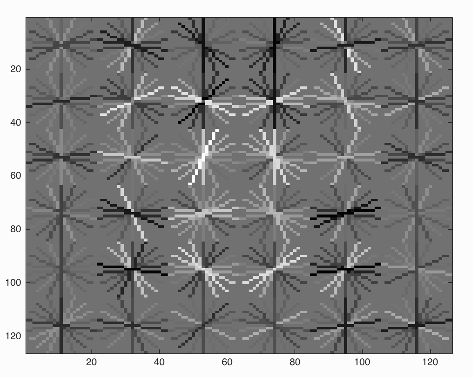
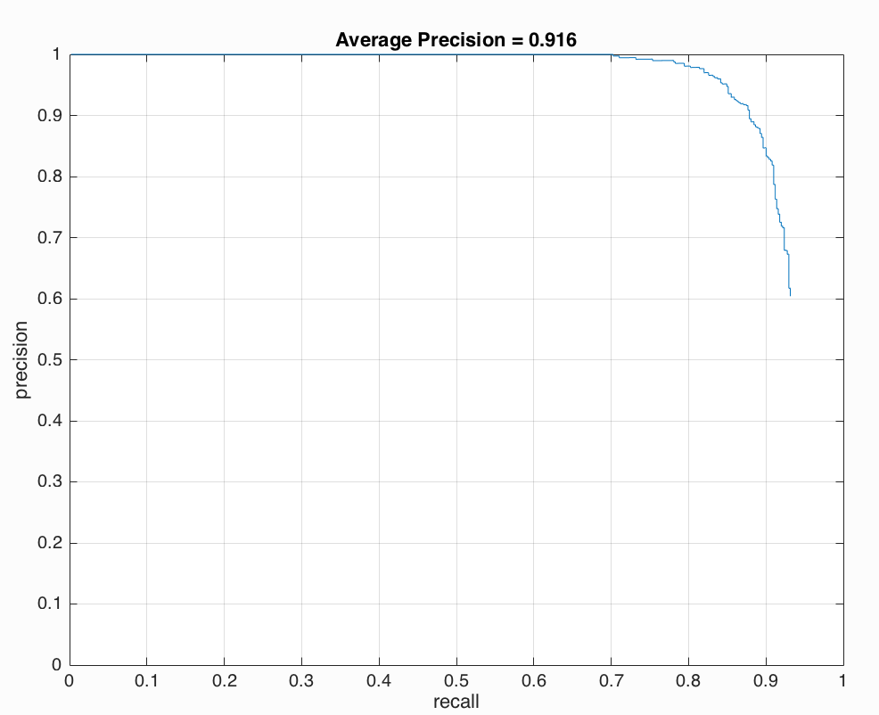
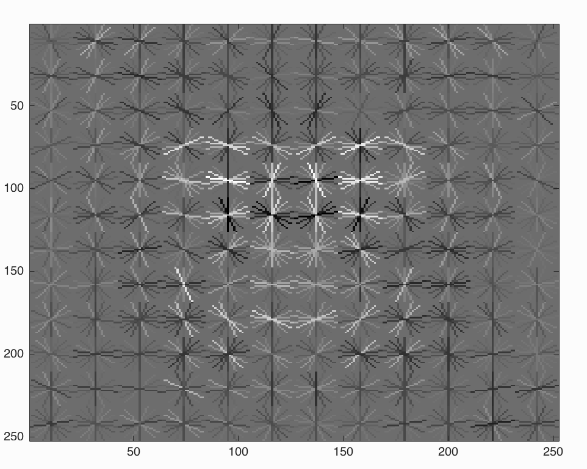
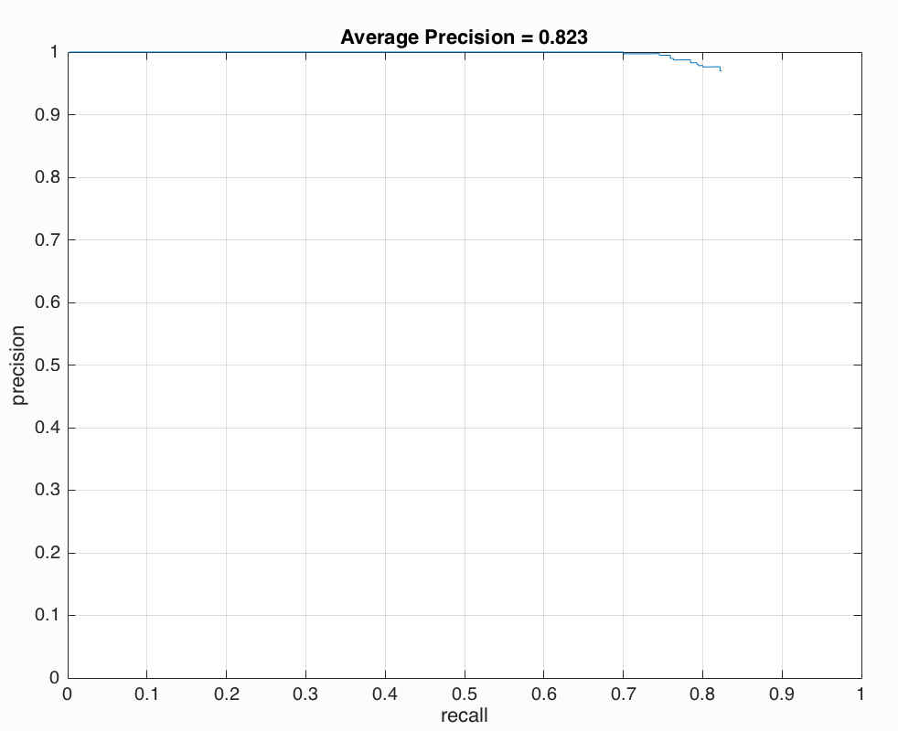
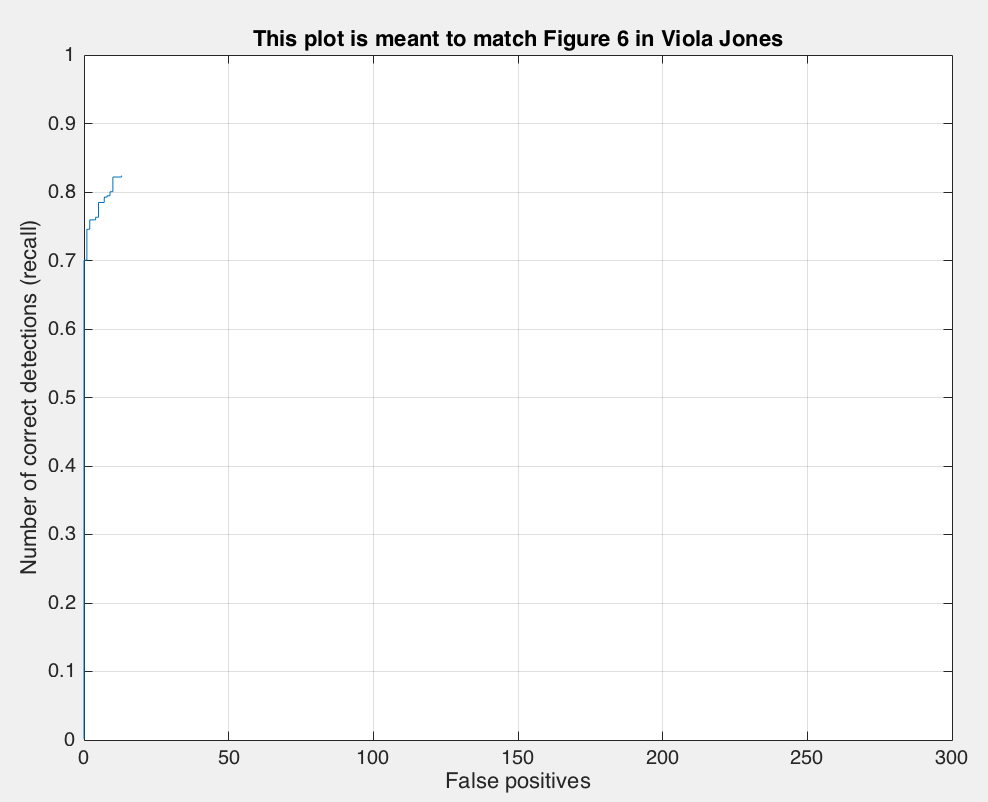
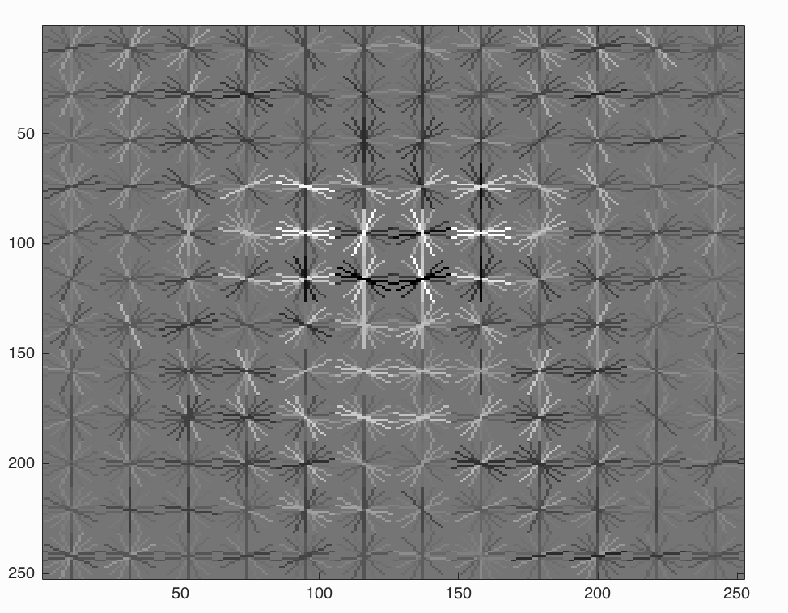
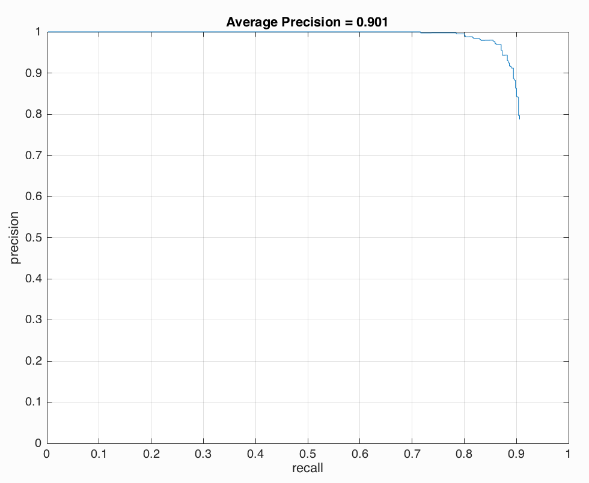
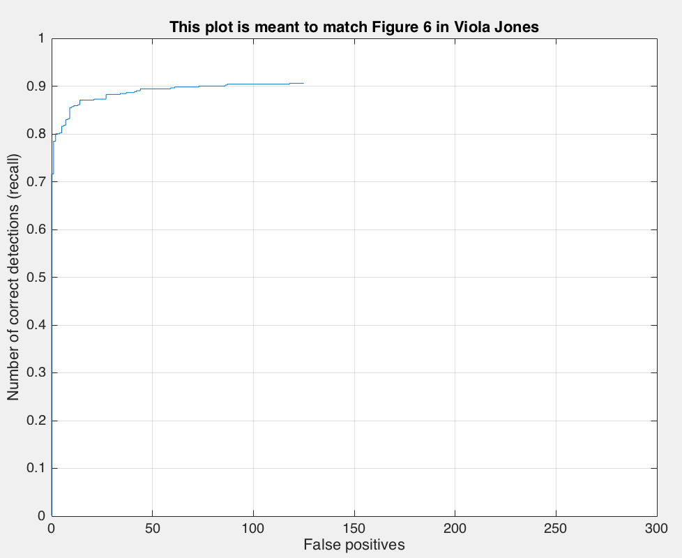
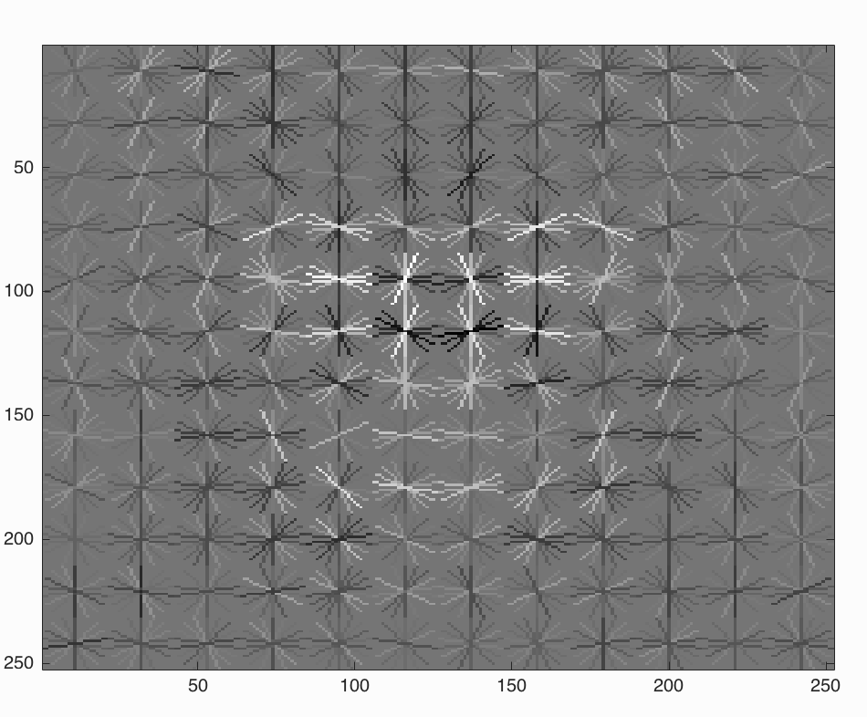

## Face Detection
The course project of COMP5421 Computer Vision

### General Idea
The task given by this assignment is to implement a multi-scale sliding window face detector based on concepts presented in Dalal-Triggs 2005 and Viola-Jones 2001. The algorithm will be evaluated using a common benchmark for face detection (Caltech).

### Methodology

1. Use HOG descriptor to genearte positive face images with cell size 3
2. Horizontally flip face images, contrast original face images with darker faces images( img*0.8 ), use HOG descriptor to generate postive images from these images and add these images into the postive face samples
3. Use HOG descriptor to generate negative cropped images (50000 images) from the database
4. Train the linear SVM Classifier
5. For each test image, for each position at each scale in the image, create a window and run the classifier to determine whether or not there is a face at that location
6. Step 5 will result in many overlapping bounding boxes for the the same face, which must then be combined or suppressed into one final bounding box (non maximum suppression).

### Experiments and Results
We conducted several experiments to indentify the best approach to detect the face.

1. Cell Size 6, flip and contrast the faces, without hard negative mining

++**The average accuracy is 0.840, and it is very quick.**++

2. Cell Size 3, flip and contrast the faces, without hard negative mining

++**The average accuracy is 0.916, and it takes about 20 minutes.**++

3. Cell Size 3, without hard negative mining

++**The average accuracy is 0.823, and it takes about 30-40 minutes.**++

4. Cell Size 3, flip and contrast the faces, with hard negative mining

++**The average accuracy is 0.901, and it takes about 90 minutes.**++

### Discussion

1. Notice that when the cell size gets smaller, the HOG descriptor can persent more details about the gradient and edge direction at each pixel, which leads to higher accuracy.

2. With more negative samples, the accuracy can be improved a bit, but at the same time, the detection speed becomes slow.

3. When we horizontally flip face images and make images darker (i.e. add more positive training data), we can largley improve the accuracy since we found that some faces in very dark background could not be detected and some side faces can not be recognized.

4. LBP  

### Bonus

#### Hard Negative Mining.
Train on the original datasets, collect images which are falsely detected as faces and add them into the negative samples. Retrain again.

#### Find and utilize alternative positive training data.
1. Horizontally Flip face images
2. Generate contrast images (image * 0.8)

#### Implement an interesting feature
Implement Local Binary Pattern (LBP). Instead of using HOG descriptor, we use LBP to extract features from images.