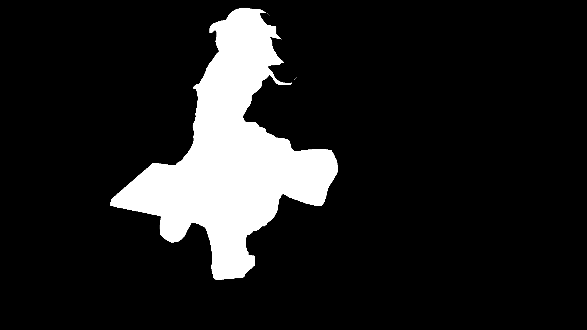

# General Desciption

This repo contains four projects for COMP5421 - Computer Vision@HKUST. And each of these four projects involves different knowledge background about computer vision.

* You may need UST CSE account to access some webpages.

## Image scissor

### General Idea

The general idea of this project is that after loading the image, we finished the cost computation by implementing the cost function provided in the [course webpage](https://course.cse.ust.hk/comp5421/Password_Only/projects/iscissor/index.html)*. Every time when the user clicks a seed, we will update the path tree according to the Dijkstra's algorithm.

### Artifacts

#### Original Images and Masks

We provide three images, one background image and two foreground images.
Foreground Image One:

Mask of Foreground Image One:

Foreground Image Two:

Mask of Foreground Image Two:

Background image:


#### Results

The result is cool!!!


### Bonus

We implemented two ```whistles``` for this project.

- SnapSeed

To snap the first seed near the edge, we find the nearest neighbor of the seed on the edge after the user clicks the first seed. We used ```CV::Canny``` to get the edge and then use ```L2 distance``` to meansure the space similarity. Update the position of the first seed each time when finding out a optimal point.

- Blurring

We include two gaussian blurring filters in the projects such that the user could apply anyone of them to compare the difference before and after blurring.

## Face detection

## Single view metrology

## Multiple view modeling
