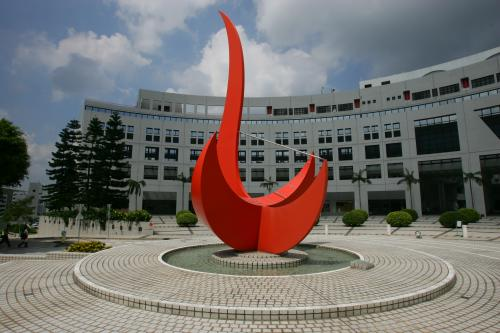

## Image scissor

### General Idea

The general idea of this project is that after loading the image, we finished the cost computation by implementing the cost function provided in the [course webpage](https://course.cse.ust.hk/comp5421/Password_Only/projects/iscissor/index.html)*. Every time when the user clicks a seed, we will update the path tree according to the Dijkstra's algorithm.

### Artifacts

#### Original Images and Masks

We provide three images, one background image and two foreground images.

Foreground Image One and its mask:


Foreground Image Two and its mask:


Background image:


#### Results

The result is cool!!!


### Bonus

We implemented two ```whistles``` for this project.

- SnapSeed

To snap the first seed near the edge, we find the nearest neighbor of the seed on the edge after the user clicks the first seed. We used ```CV::Canny``` to get the edge and then use ```L2 distance``` to meansure the space similarity. Update the position of the first seed each time when finding out a optimal point.

- Blurring

We include two gaussiFor blurring effect, and we use opencv Guassian filter. We adjust the Guassian filter kernel size and standard deviation to achieve different level of blurring effect. After opening the image, we could add this blurring effect using the interface of our IScissor.
	```Tool -> Gaussian 3*3```
    ```Tool -> Gaussian 5*5```
After click on these two buttons, the image will be blurred. We provide a sample with our school HKUST. You can see that different level of blurring effect has been achieved. Comparing two filters, we could see that larger kernel size induces stronger blurring effect. See pics.an blurring filters in the projects such that the user could apply anyone of them to compare the difference before and after blurring. ***Also we notice that if the blurring effect gets stronger, the cost gets lower.***

- Orignal Pic and its cost graph:



- Blurring with 3*3 gaussian filters


- Blurring with 5*5 gaussian filters


